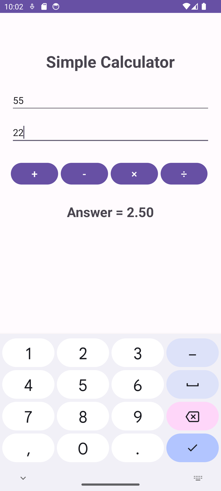

# Simple Android Calculator

This is a simple calculator Android application built using Kotlin. The app allows users to perform basic arithmetic operations such as addition, subtraction, multiplication, and division.

## Features

- **Addition**: Add two numbers.
- **Subtraction**: Subtract one number from another.
- **Multiplication**: Multiply two numbers.
- **Division**: Divide one number by another.

## Project Structure

- `MainActivity.kt`: Contains the main logic of the calculator app.
- `activity_main.xml`: Defines the user interface (UI) of the application, including the input fields and operation buttons.

## Screenshots

### UI Design



## Installation

1. Clone the repository:

   ```bash
   git clone https://github.com/rishi-vakharia/android-calculator.git
   ```

2. Open the project in Android Studio.

3. Build and run the project on an emulator or a physical device.

## How It Works

1. **User Interface**: The UI consists of two input fields where users can enter numbers and four buttons to select the desired arithmetic operation (addition, subtraction, multiplication, division).

2. **Event Handling**: When the user clicks on an operation button, an event listener is triggered, which calls the `performOperation` function with the corresponding operator.

3. **Operation Logic**: The `performOperation` function retrieves the input numbers, performs the selected operation, and displays the result on the screen. Division by zero is handled explicitly by checking if the denominator is zero and displaying an error message.

4. **Output**: The result of the operation is displayed below the buttons.

## Requirements

- Android Studio
- Kotlin

## References

https://www.youtube.com/watch?v=4DGLcL4v6Qo&list=PLwdyClKyR9FxZzFWpwbJANdIzTCNvqd9a&index=2&t=755s